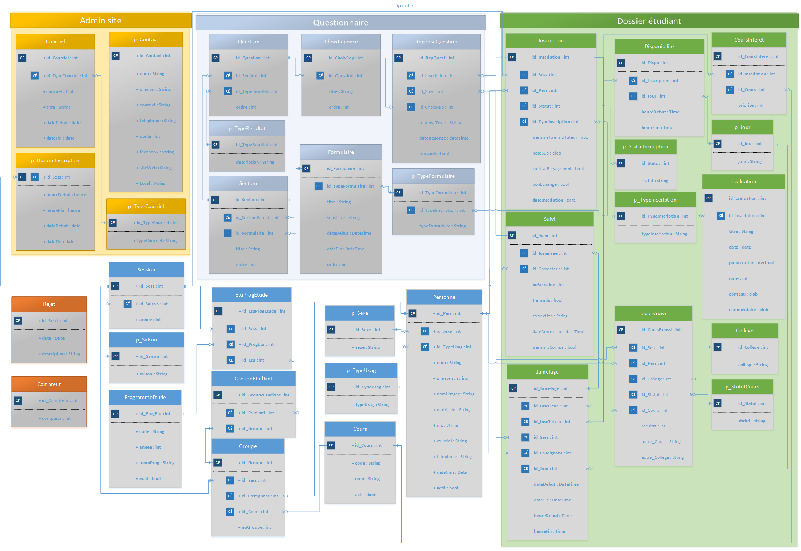

# Projet web du SACHEM

* [SACHEM](#sachem)
    * [Processus](#processus)
    * [Inscription](#inscription)
    * [Jumelage](#jumelage)
    * [Après jumelage](#après-jumelage)
* [Développement](#développement)
    * [Matériels nécessaires](#matériels-nécessaires)
        * [SQL Server](#sql-server)
        * [Visual Studio](#visual-studio)
            * [Dépendances VS](#dépendances-vs)
    * [Commencer](#commencer)
        * [Web.config](#webconfig)
        * [Navigation sur le site](#navigation-sur-le-site)
    * [Structuration de nos branches](#structuration-de-nos-branches)
    * [Problèmes et fonctionnalités](#problèmes-et-fonctionnalités)
* [Annexe](#annexe)
   * [Diagramme de classes](#diagramme-de-classes)
   * [Dossiers fonctionnels](#dossiers-fonctionnels)
   * [Captures](#captures)
   * [Crédits](#crédits)
   
# SACHEM

Projet ASP.NET MVC 5 pour informatiser les documents d'inscription et de jumelage entre élèves du service d'aide en mathématiques au Cégep de Lévis-Lauzon.

## Processus

Le SACHEM permet à un étudiant (élève aidé) de réclamer de l'aide pour améliorer sa compréhension de différentes notions en mathématiques dans le but d'améliorer ses résultats. Le SACHEM permet également à un étudiant ayant de la facilité en mathétiques d'accompagner un élève en difficulté dans sa compréhension des mathématiques, de devenir un tuteur : Tuteur de cours (cours de Tutorat en Mathématiques à son horaire) ou tuteur bénévole (moyenne générale de plus de 85%). Par la suite, selon le bassin des tuteurs disponibles et le nombre maximale de 4 jumelages par tuteur, le SACHEM mettera en place des jumelages entre élève aidé et tuteur selon leur propre horaire de disponibilités. Chaque jumelage sera supervisé par un enseignant pour assurer un suivi constant de la progression de l'élève aidé.

## Inscription

Ce service est disponible que pour les étudiants ayant un cours mathématiques durant la session actuelle au Cégep de Lévis-Lauzon. L'étudiant doit définir quel type de compte il désire créer: étudiant aidé, étudiant tuteur bénévole, étudiant tuteur de cours. Puis, il doit remplir le formualire d'inscription.

## Jumelage

Les jumelages seront créés une fois la période d'inscription terminée. Ils seront créés de façon automatique selon la compatibilité des plages de disponibilités des étudiants.


## Après jumelage

Par l'entremise du site, l'enseignant doit livrer des documents (devoirs ou instructions) au tuteur d'un jumelage, pour être complétés avec son étudiant aidé. Le tuteur doit compléter son cahier de suivi hebdomadairement pour indiquer la progression de l'étudiant aidé. L'enseignant peut annoter ce cahier de suivi et le retourner au tuteur par la suite.

# Développement

## Matériels nécessaires

* [Git](http://git-scm.com/book/en/v2/Getting-Started-Installing-Git): Versionner sur GitHub le projet
* [Visual Studio 2015](https://www.visualstudio.com/post-download-vs/?sku=community&clcid=0x409&telem=ga): Programmer en ASP.NET MVC
   * [.Net Framework 4.6](https://www.microsoft.com/en-ca/download/details.aspx?id=48130): Bibliothèque .Net
* [SQL Server 2016](https://www.microsoft.com/en-us/sql-server/sql-server-downloads): Application de base de données
   * [SQL Server Management Studio](https://msdn.microsoft.com/library/mt238290.aspx): Administration de la base de données
   * [Fichiers en annexe](#annexe)

### SQL Server

Pour l'installation de l'application SQL Server 2016 Developper, suivez [cette documentation](http://www.sqlcoffee.com/SQLServer2016_0001.htm)

Pour restaurer le [fichier backup](https://github.com/dinfcll/sachem/blob/jwallet-readme-doc/sachem/_Contribute/sachem.bak) de la base de données, suivez [cette documentation](http://www.howtogeek.com/50354/restoring-a-sql-database-backup-using-sql-server-management-studio/)

### Visual Studio

Pour configurer Visual Studio avec notre répertoire Git de SACHEM, vous pouvez aller voir [cette page](wiki/Contribuer-au-projet-sur-Visual-Studio-2015) de notre wiki.

#### Dépendances VS

Le projet contient certaines dépendances à des paquets NuGet dans Visual Studio. Utilisez le gestionnaire NuGet disponible dans Visual Studio pour les installer s'ils ne le sont pas:
- ASP.Net
- ASP.Net MVC
- JQuery
- Bootstrap
- Dropzone

## Commencer

Cloner le projet par ligne de commande Git:

`git clone https://github.com/dinfcll/sachem.git`

Une fois chargé, assurez-vous que votre connexion à la BD de SACHEM, dans le fichier [web.config](webconfig), correspond bien à celui de votre usager dans SQL Server.

### Web.config

Vous aurez à modifier le serveur de connexion si vous avez configuré un usager SQL Server. Vous pouvez le constater lorsque vous utilisez SQL Management Server, le "Server name", exemple `localhost\SQL`, que vous utilisez est le même que dans ce fichier. Modifier `localhost` par `localhost\MON_USAGER_SQL_SERVER`, s'il y a lieu.

```sh
 <connectionStrings>
    <add name="SACHEMEntities" connectionString="....data source=localhost;...." />
  </connectionStrings>
```

Veiller à ne pas envoyer sur la branche principale `master` votre `web.config` personnalisé. Retirez le dans le dernier `commit` lors de votre `pull request`.

### Navigation sur le site

Par défaut, le compte administrateur principal est celui du responsable SACHEM: `resp`.

Utilisez ce compte pour tester les fonctionnalités ou apporter des modifications à la base de données à partir du site, comme modifier les paramètres d'un compte utilisateur. Le mot de passe du responsable SACHEM est: `resp`.

Pour tester le site SACHEM, il vous faudra des types de comptes différents:
- SuperUtili (Niveau 4)
- Responsable SACHEM (Niveau 3)
- Enseignant (Niveau 2)
- Etudiant (Niveau 1)
   - Tuteur réménunéré (Niveau 1-B3)
   - Tuteur bénévole (Niveau 1-B2)
   - Tuteur de cours (Niveau 1-B1)
   - Élève aidé (Niveau 1-A)
   
_Note sur les étudiants_: Les tuteurs (Niveau 1-B) ont les mêmes droits au site. L'élève aidé (Niveau 1-A) est celui qui possède le moins de droits, à l'exception d'un étudiant qui ne s'est pas inscrit au SACHEM, mais n'a créé qu'un compte sur le site (Niveau 1).

Utilisez le site pour créer les comptes qui vous seront utiles pour vos tests. Utilisez également SQL Server pour naviguer dans les données disponibles de la BD, entres autres `dbo.Personne` vous donnera accès à une fausse liste d'étudiants et d'enseignants qui fréquentent le département de mathématiques. Prenez en note le `NomUsager` pour un enseignant, ajoutez-y un mot de passe en vous connectant en tant que responsable SACHEM, ou prenez en note le `Matricule` et la `DateNais` pour un étudiant pour créer un compte, vous pouvez aussi le modifier avec le responsable SACHEM. N'oubliez de créer un compte `SuperUtili` pour tester l'accès complet au site.

## Structuration de nos branches

Notre branche principale est `master`.

Toute nouvelle fonctionnalité, correction de bug et/ou test doit être réalisé dans une nouvelle branche ou avoir fait un `fork` du projet. Une fois votre changement réalisé et prêt, une demande de `Pull Request` peut être créé pour affecter master.

Nous demandons à ceux travaillant sur des branches autres que master de synchroniser fréquemment avec master pour obtenir les plus récents ajouts.

Veiller à ne pas envoyer sur la branche principale votre `web.config` personnalisé. Retirez s'il est présent dans votre pull request.

## Problèmes et fonctionnalités

Rapportez en tant que nouvelle `issue` tout:
- Bug à fixer
- Nouvelle fonctionnalité à concevoir
- Suggestion ou question

Ajoutez votre nouvelle issue dans: `Projects > Projet SACHEM > Add cards`.

Sélectionnez votre issue et déposez le dans `A faire`.

Un suivi de votre issue sera fait.

# Annexe

## Diagramme de classes



## Dossiers fonctionnels

Voici la liste des dossiers fonctionnels conçus par [Josée Lainesse](#) qui ont permis de concevoir ce projet:

* [Se connecter](sachem/_Contribute/dossiersFonctionnels/P490_Se_connecter.pdf)
* [MAJ Parametres](sachem/_Contribute/dossiersFonctionnels/P490_MAJ_Paramatres.pdf)
* [MAJ Dossier étudiant](sachem/_Contribute/dossiersFonctionnels/P490_MAJ_Dossier_étudiant.pdf)
* [MAJ Enseignant](sachem/_Contribute/dossiersFonctionnels/P490_MAJ_Enseignant.pdf)
* [MAJ Etudiant](sachem/_Contribute/dossiersFonctionnels/P490_MAJ_Etudiant.pdf)
* [MAJ Cours](sachem/_Contribute/dossiersFonctionnels/P490_MAJ_Cours.pdf)
* [MAJ Groupe](sachem/_Contribute/dossiersFonctionnels/P490_MAJ_Groupe.pdf)
* [MAJ Programmes offerts](sachem/_Contribute/dossiersFonctionnels/P490_MAJ_Programmes_offerts.pdf)
* [Consulter cours](sachem/_Contribute/dossiersFonctionnels/P490_Consulter_cours.pdf)
* [Importer données](sachem/_Contribute/dossiersFonctionnels/P490_Importer_données.pdf)
* [Gérer inscription](sachem/_Contribute/dossiersFonctionnels/P490_Gérer_inscription.pdf)
* [Signer contrat engagement](sachem/_Contribute/dossiersFonctionnels/P490_Signer_contrat_engagement.pdf)
* [Importer données - Service Windows - Différé](sachem/_Contribute/dossiersFonctionnels/P540_ImporterDonnées.pdf)

## Captures


## Crédits

Merci à nos principaux concepteurs, en ordre alphabétique:

Robert Ableson,
Pierre Bégin,
[Anthony Benoit-Caron](https://github.com/Anthobc),
Marie-Christine Boilard,
[Simon Huard](https://github.com/simHuard),
[Olivier Lafleur](https://github.com/olafleur),
Josée Lainesse,
[Alexys Leclerc](https://github.com/LeclercA),
[Dylan Marcotte](https://github.com/FragZServer),
[Alexandre Martineau](https://github.com/AlexandreMartineau),
[Jose Ouellet](https://github.com/jwallet),
[Guillaume Prud'homme](https://github.com/GuillaumePrudhomme),
[Louis-Roch Tessier](https://github.com/louisrochtessier),
[Loïc Turgeon](https://github.com/loicturgeon),
[Alexandre Venables](https://github.com/VenablesAu),
[Cristian Zubieta](https://github.com/cristianzubieta),
et nos supers [contribueurs](https://github.com/dinfcll/sachem/graphs/contributors).
